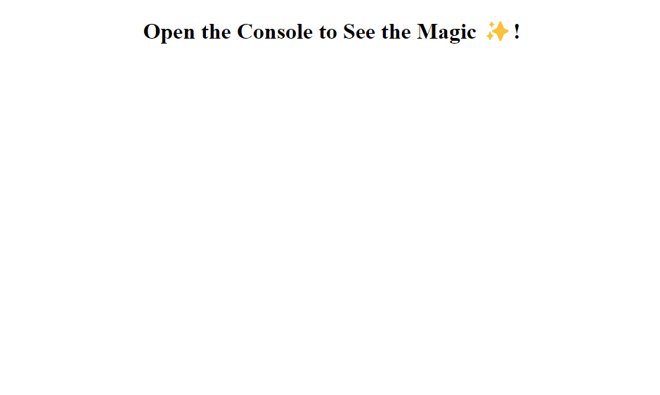
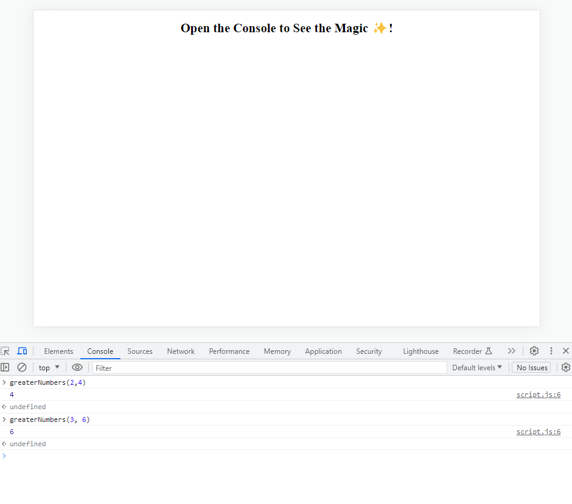

# Greater Numbers of Two

## Description
```
    Write a function that takes in two numbers and outputs the max (the greater of the two numbers). *** Make sure to test it in your browser's console. ***

    Ex: 
    Input: 1, 2
    Output: 2

    Input: 6, -4
    Output: 6

    Input: 3.4, 2
    Output: 3.4
```
The challenge was to allow the user to input two numbers are be able to see the Devtools display that greater number of the two numbers given. Through this challenge, I was able to better understand how functions works and using conditional "if" statement. 

Website: https://auom-eisiad.github.io/GreaterNumbers/


## Table of Contents (Optional)

If your README is long, add a table of contents to make it easy for users to find what they need.

- [Installation](#installation)
- [Usage](#usage)
- [Credits](#credits)
- [License](#license)

## Installation

N/A

## Usage

When you enter the broswer, the user asked to open into their console which they can do by right-click and clicking on Inspect on the menu or using CTRL + SHIFT + I. Once in the Devtools, they user can input their own numbers by typing "greaterNumbers(x,y)" while replacing the x and y with the numbers they want to compare. Once logged, the function will output which of the numbers is greater. 

    ```md
    
    ```

## Credits

N/A

## License

N/A

## Badges

N/A

## Features

N/A

## How to Contribute

N/A

## Tests

N/A